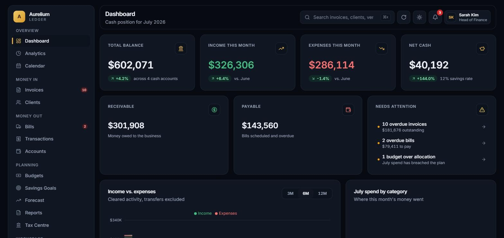
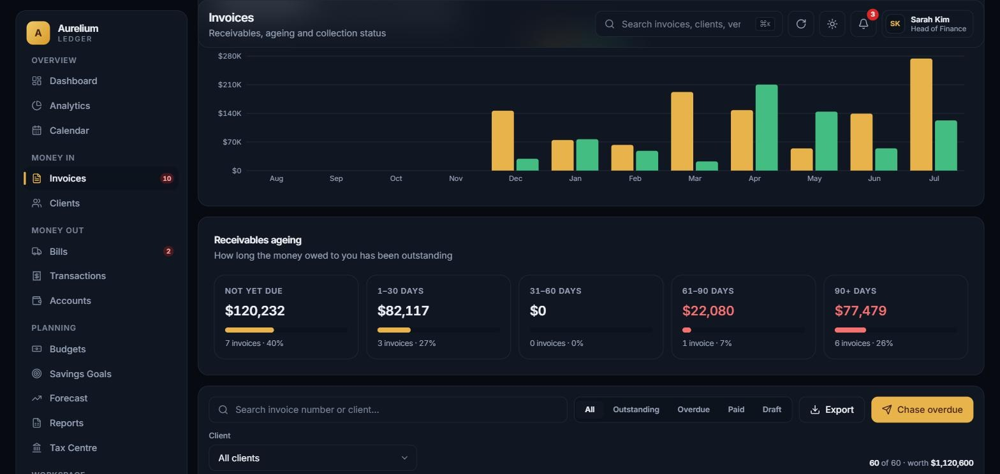
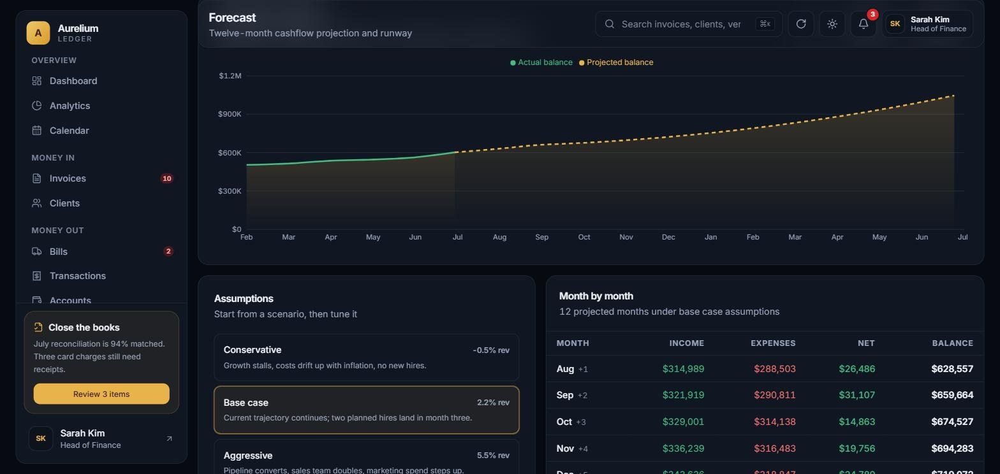
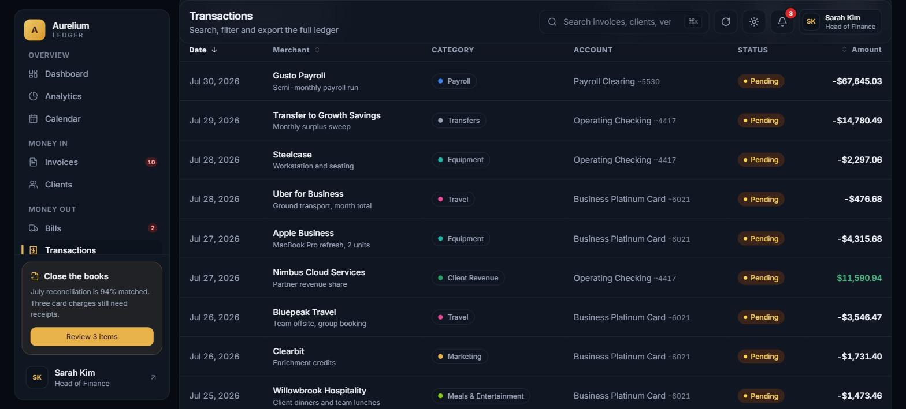
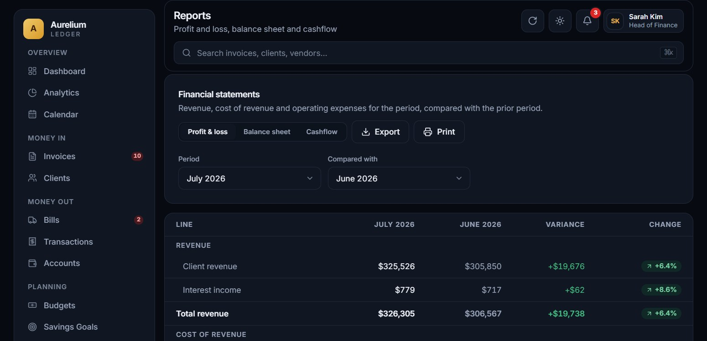
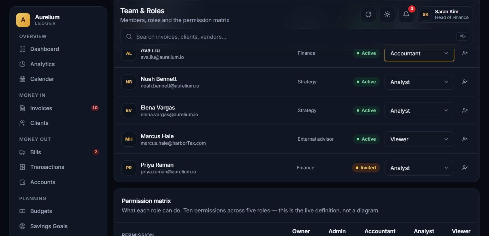
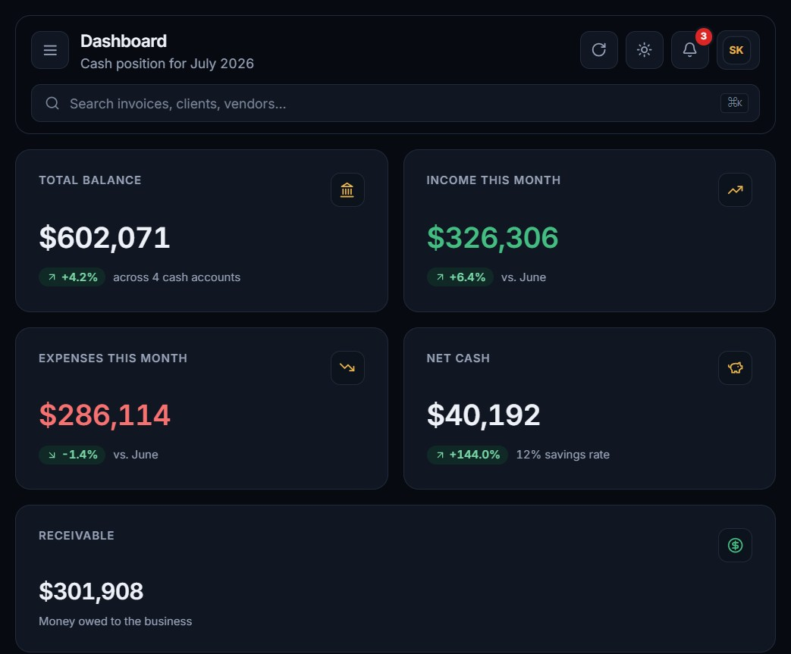
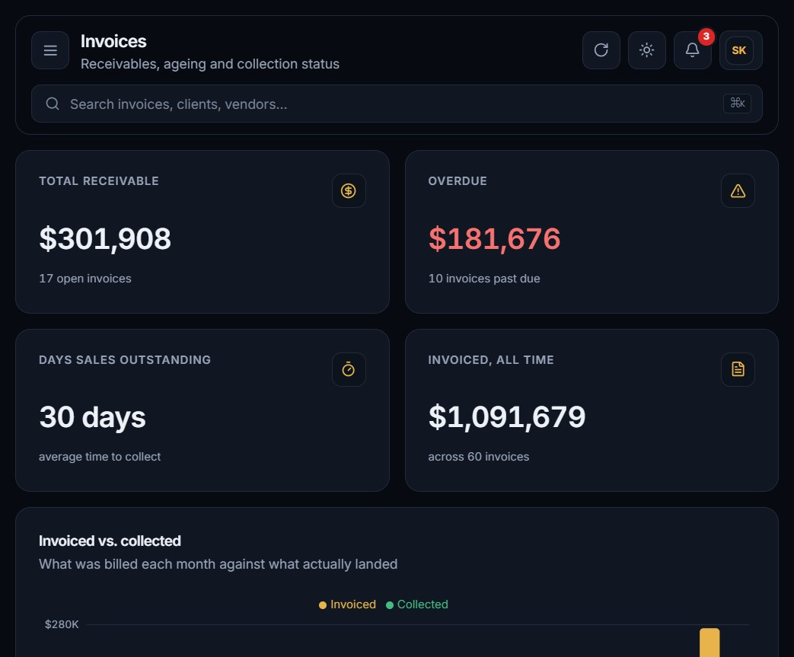
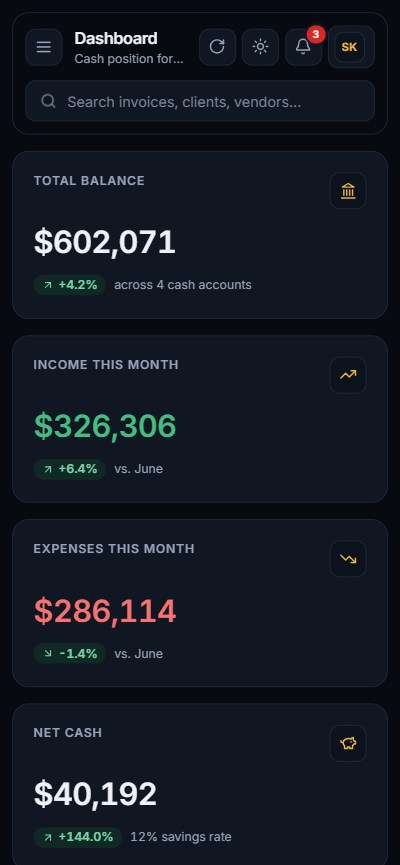
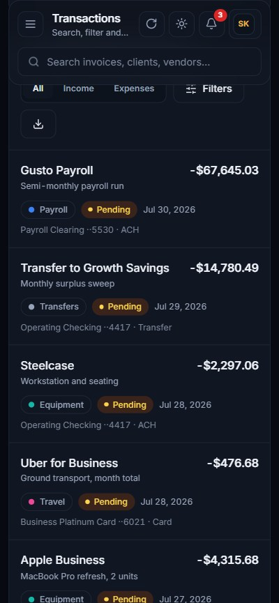

# Aurelium Ledger

A business finance dashboard covering receivables, payables, budgeting, forecasting and statutory reporting — with a public product site in front of it.


## About

Aurelium Ledger is a finance dashboard for a small-to-mid-size business: one place to see cash position, chase unpaid invoices, schedule vendor bills, track budgets against actual spend, and project cashflow forward. It is aimed at the person who owns the numbers — a finance lead, founder or bookkeeper who would otherwise be reconciling several bank tabs against a spreadsheet.

The application is a front-end build with no backend. All figures come from a deterministic dataset generated locally at build time, so the interface can be explored end to end without an account or a connected bank.

## Live Demo

**[aurelium-finance-dashboard.vercel.app](https://aurelium-finance-dashboard.vercel.app/)**

The dashboard opens directly at `/dashboard` — no sign-up required.

## Key Features

**Receivables**
- Invoices with line items, quantity, unit price and tax rate across five states (draft, sent, paid, overdue, void)
- A/R ageing report split into current / 1–30 / 31–60 / 61–90 / 90+ day buckets, each clickable to filter the list
- Days-sales-outstanding calculated from actual issue-to-settlement dates
- Invoiced-vs-collected chart comparing what was billed each month against what was received
- Detail drawer with the full line breakdown, subtotal, tax and total

**Payables**
- Vendor book with bills in draft, scheduled, paid and overdue states
- Recurring bills flagged and filterable separately from one-off spend
- Working-capital position stated as receivable minus payable

**Ledger and accounts**
- Transaction table with debounced search, seven filters (direction, category, account, status, and an inclusive from/to month range), sortable columns and selectable page size
- Five accounts including a credit line with a utilisation bar against its limit
- Per-account statement export

**Planning**
- Category budgets with on-track, near-limit (≥90%) and over-allocation states, reconciled against ledger spend
- Twelve-month cashflow projection across three scenarios, with sliders for revenue growth, expense growth and planned monthly cost; runway and break-even month are derived from the inputs
- Profit & loss, balance sheet and indirect cashflow statement, each with a period comparison and variance column
- Tax centre with quarterly estimates, amounts paid, outstanding shortfall and a set-aside calculator
- Savings goals with funding progress and months-remaining calculation
- Calendar built from the actual bill, invoice, payroll and tax-deadline records rather than a separate event list

**Workspace**
- Five roles across ten permissions, rendered as a live matrix that updates when a member's role changes
- Members can be invited, suspended and restored
- Audit log of 80 events filterable by actor, action, area and severity

**Application-wide**
- Command-palette search (`⌘K` / `Ctrl+K`) across invoices, clients, vendors, bills, transactions and accounts, with keyboard navigation and deep links into the relevant module
- CSV export on thirteen screens, generated in the browser to RFC 4180 and reporting failure honestly if the browser blocks the download
- Light and dark themes, applied before first paint so a reload never flashes the wrong palette
- Display currency, date format and row density preferences that propagate app-wide and persist to `localStorage`
- Error boundaries around every chart, plus route-level and global fallbacks
- Responsive from 390px up: tables become stacked cards below `md`, and the sidebar becomes a focus-managed drawer below `lg`
- Accessibility: skip link, focus traps in dialogs and drawers, `aria-sort` on sortable columns, WCAG AA contrast in both themes, and `prefers-reduced-motion` support

## Screenshots

### Desktop

Dashboard — cash position, receivables and payables, and items needing attention



Invoices — invoiced vs. collected, and the A/R ageing report



Forecast — actual balance against a twelve-month projection, with tunable assumptions



Transactions — the sortable, filterable ledger



Reports — profit & loss with period comparison and variance



Team & Roles — members, role assignment and the permission matrix



### Tablet





### Mobile





## Tech Stack

**Frontend**
- Next.js 14.2 (App Router)
- React 18.3
- TypeScript 5.9 (`strict`)

**Styling**
- Tailwind CSS 3.4 with CSS-variable theme tokens
- `clsx` + `tailwind-merge` for class composition
- Inter, self-hosted via `next/font`

**Data Visualisation**
- Recharts 2.15
- `lucide-react` for iconography

**State Management**
- React Context for theme, display preferences, notifications and toasts
- Local component state elsewhere — no external state library

**Backend / API**
- None. No server, no database, no external services. Data is generated locally in `lib/data/` and the only browser APIs used are `localStorage` for preferences and `Blob` / `createObjectURL` for CSV export.

**Tooling**
- ESLint 8 with `eslint-config-next`
- PostCSS + Autoprefixer
- Deployed on Vercel

## Getting Started

Requires **Node.js 18.17** or newer.

```bash
git clone https://github.com/<your-username>/aurelium-finance-dashboard.git
cd aurelium-finance-dashboard
npm install
npm run dev
```

The development server runs at `http://localhost:3000`.

**Production build:**

```bash
npm run build
npm start
```

**Other scripts:**

```bash
npm run lint       # ESLint via next lint
npx tsc --noEmit   # Type-check without emitting
```

## Project Structure

```
app/
  (marketing)/        Public site — landing, features, pricing, about, contact
  login/              Demonstration sign-in flow
  dashboard/          16 module routes
  error.tsx           Route-level error boundary
  global-error.tsx    Root fallback
  globals.css         Theme tokens and component layer

components/
  charts/             Memoised Recharts wrappers with themed tooltips
  layout/             Dashboard shell
  marketing/          Public-site header, footer, sections, pricing, contact
  navigation/         Sidebar, topbar, global search, theme toggle
  pages/              One client component per dashboard module
  providers/          Theme, preferences, notifications, toasts
  ui/                 Button, card, field, badge, modal, drawer, data-table,
                      progress, skeleton, stat-card, states, toast

lib/
  data/               Domain modules and the deterministic seed generator
  selectors.ts        Derived totals, ageing, reports, forecasting, search
  hooks.ts            Count-up, loading, debounce, dismiss handlers
  csv.ts              CSV builder and browser download
  types.ts            Shared domain types
  utils.ts            Currency, date and percentage formatting
```

## A Note on the Data

There is no client or production data in this repository. The dataset — roughly 640 transactions, 60 invoices, 40 clients, 40 bills and 40 vendors — is generated at build time from handwritten seeds using a hash function, with no `Math.random()` and no `Date.now()`. Server and client therefore render identical output, and the figures stay stable between reloads and deployments.

## Author

**Sayed Muhammad** — React / React Native / Frontend Developer

- Email: [sayedmuhammad.dev@gmail.com](mailto:sayedmuhammad.dev@gmail.com)
- LinkedIn: [linkedin.com/in/syed-muhammad-66b493179](https://www.linkedin.com/in/syed-muhammad-66b493179)
